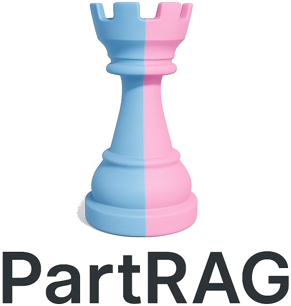

#  PartRAG: Retrieval-Augmented Part-Level 3D Generation and Editing

This is the official repository for the paper:

> **PartRAG: Retrieval-Augmented Part-Level 3D Generation and Editing**
>
> Peize Li\*, [Zeyu Zhang](https://steve-zeyu-zhang.github.io/)\*†, Hao Tang‡
>
> \*Equal contribution. †Project lead. ‡Corresponding author.
>
> ### [Paper](https://arxiv.org/abs/2602.17033) | [Website](https://aigeeksgroup.github.io/PartRAG/) | [Model](https://huggingface.co/AIGeeksGroup/PartRAG) | [HF Paper]()


## Citation

```
@article{li2026partrag,
  title={PartRAG: Retrieval-Augmented Part-Level 3D Generation and Editing},
  author={Li, Peize and Zhang, Zeyu and Tang, Hao},
  journal={arXiv preprint arXiv:2602.17033},
  year={2026}
}
```

This repository is based on [PartCrafter](https://github.com/wgsxm/PartCrafter) and extends it with the PartRAG retrieval and editing pipeline.

## Project Structure

Core structure follows the upstream layout:

- `configs/`
- `datasets/`
- `scripts/`
- `settings/`
- `src/`

PartRAG-specific additions are kept in:

- `configs/partrag_stage1.yaml`
- `configs/partrag_stage2.yaml`
- `scripts/build_partrag_retrieval_database.py`
- `scripts/edit_partrag.py`
- `src/retrieval/retrieval_module.py`
- `src/utils/part_editing.py`

## Training (Paper Protocol)

Stage 1 (RAG + flow matching):

```bash
bash scripts/train_partrag.sh \
  --config configs/partrag_stage1.yaml \
  --use_ema \
  --gradient_accumulation_steps 1 \
  --output_dir output \
  --tag partrag_stage1
```

Stage 2 (add hierarchical contrastive retrieval losses):

```bash
bash scripts/train_partrag.sh \
  --config configs/partrag_stage2.yaml \
  --use_ema \
  --gradient_accumulation_steps 1 \
  --output_dir output \
  --tag partrag_stage2
```

## Pretrained Weights

PartRAG is designed to fine-tune from upstream open checkpoints.

- Default upstream repositories:
  - `wgsxm/PartCrafter` (base model)
  - `wgsxm/PartCrafter-Scene` (scene model)
- Training and inference scripts now resolve weights in this order:
  - preferred local PartRAG path (for example `/root/autodl-tmp/PartRAG/pretrained_weights/PartRAG`)
  - local legacy PartCrafter-compatible paths
  - auto-download from upstream if not found locally
- Use `--local_files_only` to disable auto-download and require local checkpoints.

## Retrieval Database (Paper Settings)

Build CLIP + DINOv2 retrieval DB with k-means subset selection and FAISS index:

```bash
python scripts/build_partrag_retrieval_database.py \
  --config configs/partrag_stage1.yaml \
  --output_dir retrieval_database_high_quality \
  --subset_size 1236 \
  --build_faiss
```

## Editing

Part-level masked editing (preserves non-target parts and part transforms):

```bash
python scripts/edit_partrag.py \
  --checkpoint_path <ckpt_dir> \
  --input_image <image_path> \
  --target_parts 1,3 \
  --edit_text "replace legs" \
  --retrieval_db <retrieval_db_dir>
```

## Notes

- Keep dependencies aligned with `settings/setup.sh` and `settings/requirements.txt`.
- Dataset preprocessing instructions remain in `datasets/README.md`.

## Attribution

PartRAG builds on the open-source implementation of PartCrafter. Upstream-derived components are kept in the same module layout and extended with retrieval and editing-specific logic.
